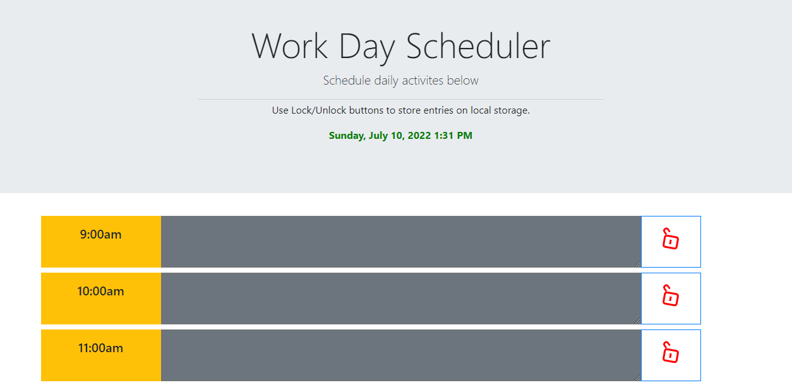

# Work_Day_Scheduler
daily calendar application made with the following:
HTML,
CSS,
Javascript,
JQueiry,
MomentJS,

Wesbite is designed to display a daily planner with a series of hourly timeblocks over the workday.

At the top of the screen, it should show the current day, date and time as an HH:MM:SS:AM/PM format.

Website has the ability to have items entered in each timeslot. Using the "lock/unlock" buttons commits the text to local storage and it is then retrieved from local storage when the website is opened again or refreshed.

Repository contains:
index.html,
style.css,
script.js,
moment.js,
Screenshot.png,
README.md

Below is a screenshot of the webpage when opened in the browser.

URL for deployed application is: https://huwrichmond.github.io/Work_Day_Scheduler/